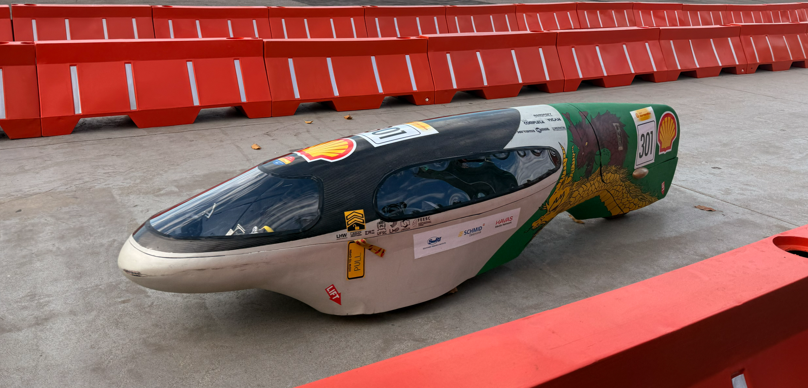

### ABOUT US
Founded in 2009, E3 UFSC is a multidisciplinary student team at the Federal University of Santa Catarina (UFSC). We design, develop, build, and validate ultra-efficient battery-electric prototype vehicles for the Shell Eco-marathon, fostering innovation, energy efficiency, and technological advancement through engineering, collaboration, and hands-on experience.

🏆 **Latin American record holder in the Shell Eco-marathon Battery-Electric Prototype category.**

  

